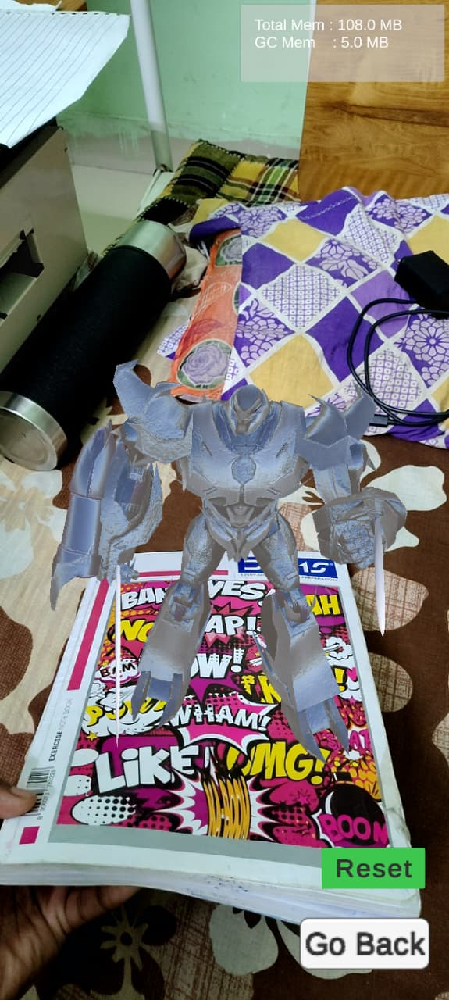
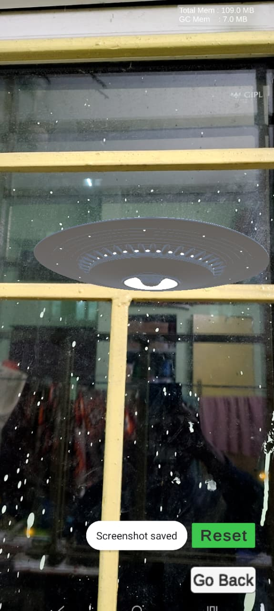
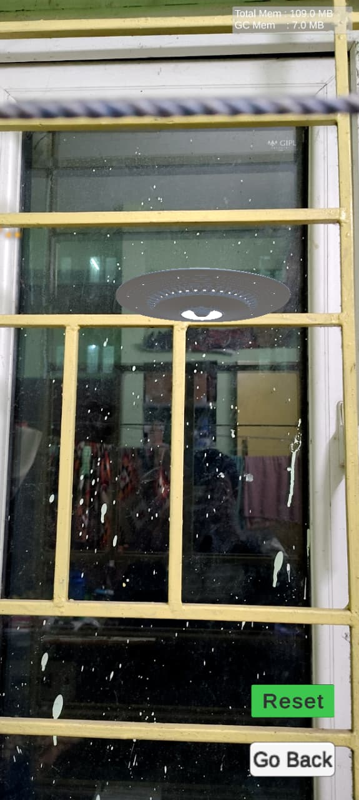
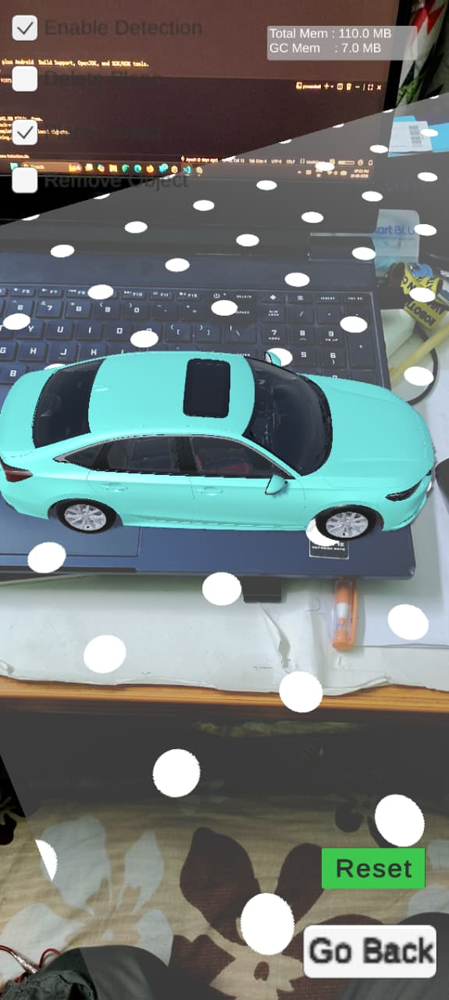
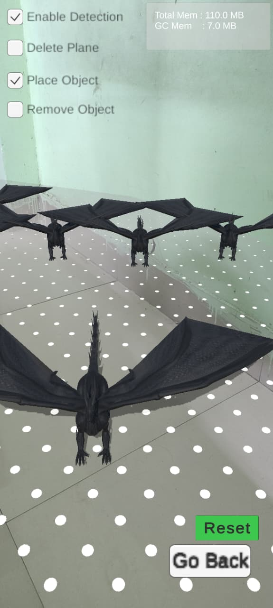
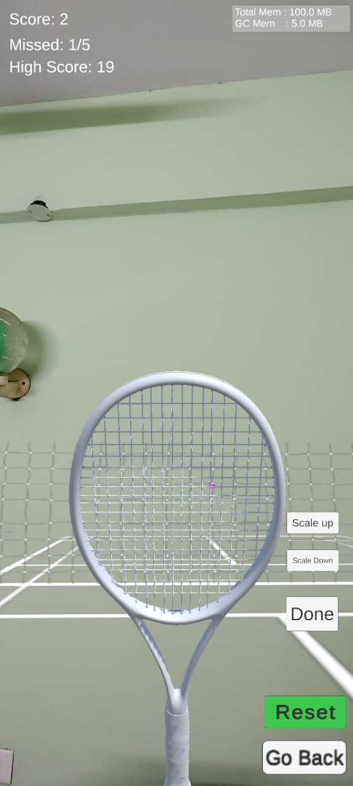

# AR Learning (Unity AR foundation : ARCore)

Prototype-ready AR Foundation project featuring fast plane detection, multi-mode placement (tap, drag, feature points), and a set of demo scenes: **ScenePrime** for the core flow, **ImageTrackingScene** for tracked prefabs, **PointCloudScene** for feature-point placement, **carScene** for vehicle anchoring, and mini-game playgrounds like **BallShootingGameScene** and **Scene_Dragon**. Great for showcasing interactions or bootstrapping an Android AR prototype.

An AR Foundation sample focused on reliable plane detection, responsive placement controls, and lightweight diagnostics. The project targets Unity **6000.2.6f2** (Unity 6) and ships with XR Interaction Toolkit, ARCore XR Plug-in, and AR Foundation 6.2, making it a solid starting point for Android AR prototypes.

Repository URL: https://github.com/Ahmev-Ayush/AR-Learning.git

## Working with Scenes
- **ScenePrime** – default showcase scene combining plane toggles, menu controls, and placement scripts.
- **ImageTrackingScene** – configured with a reference image library to test `ImageTrackingManager` and prefab spawning.


- **PointCloudScene** – use to place a flying saucer prefab to interact with point cloud feature points.


- **carScene** & **Scene_Dragon** – uses the car and dragon placement scripts to anchor a vehicle and dragon prefab on detected planes.



- **BallShootingGameScene**  – experimental playgrounds for physics interactions



## Project Layout
| Folder | Purpose |
| --- | --- |
| `Assets/MobileARTemplateAssets` | Core scripts, prefabs, materials, and UI assets used across the demo scenes. |
| `Assets/Scenes` | Ready-to-open Unity scenes covering plane placement, image tracking, vehicle placement, and mini-game prototypes. |
| `Assets/Pipelines`, `Settings`, `TextMesh Pro`, `XR`, `XRI` | Supporting render pipeline assets, volume profiles, fonts, and XR Interaction Toolkit configurations. |
| `Build` | Auto-generated Burst debug data from previous builds (safe to delete if storage is a concern). |

## Project Structure
```text
📦 YourProject/
├── 📂 Assets/
│   ├── 📂 Butterfly (Animated)/
│   ├── 📂 MobileARTemplateAssets/
│   │   ├── 📂 Materials/
│   │   ├── 📂 Prefabs/
│   │   ├── 📂 Scripts/     ← All scripts used in the project are here
│   │   ├── 📂 Shaders/
│   │   ├── 📂 Tutorial/
│   │   └── 📂 UI/
│   ├── 📂 Prefabs/         ← All prefabs are here that are used in the project
│   ├── 📂 Resources/
│   │   ├── 📂 Images/      
│   │   └── 📂 Materials/   ← All Materials are here that are used in the project
│   ├── 📂 Samples/
│   ├── 📂 Settings/
│   ├── 📂 Scenes/
│   ├── 📂 TextMesh Pro/
│   ├── 📂 XR/
│   └── 📂 models/
├── 📂 Packages/
├── 📂 ProjectSettings/
├── 📂 Demos/                  ← demos videos and screenshots
│   ├── 📂 /
│   ├── 📂 /
├── 📄 .gitignore
├── 📄 README.md
├── 📄 project-structure.txt   
└── 📄 DEVLOG.md               
```

## Requirements
- Unity Hub with **Unity 6000.2.6f2** plus Android  Build Support, OpenJDK, and SDK/NDK tools.
- ARCore-device running Android 10+ .
- USB debugging enabled (Android).
- Optional: TextMeshPro Essentials imported (already configured in this project) for the diagnostics overlay.

## Quick Start
1. Clone the repository (`git clone https://github.com/Ahmev-Ayush/AR-Learning.git`) or download the ZIP into a local folder.
2. Open Unity Hub → **Open** → select `Plane Detection/Plane Detection.sln` or the folder root.
3. When prompted, install Unity 6000.2.6f2; allow the Editor to update the project.
4. In **Build Settings**, switch the platform to **Android**  and click **Apply**.
5. Open `Assets/Scenes/ScenePrime.unity` to explore the standard plane-detection flow. Use Play Mode with a webcam/AR simulation or deploy to device for accurate tracking.
6. Connect a device, press **Build & Run**, and test the placement modes, menu toggles, and debug overlays directly on hardware.

## Building for Device
- **Android**: 
	- Enable **ARM64** architecture with IL2CPP and strip unused managed code for smaller builds.
	- Under **Project Settings → XR Plug-in Management**, enable **ARCore** for Android and ensure required permissions (camera) are checked.
	- If you use feature-point placement, keep depth and point-cloud subsystems enabled in **XR Origin**:


## Key Scripts & How to Extend
| Script | Description | Extension Tips |
| --- | --- | --- |
| `Scripts/ARModeController.cs` | Centralizes UI toggles for plane detection, plane deletion, object removal, and placement gating. | Ensure your placed prefabs use the `PlacedObjects` layer so the removal raycasts work. Add more modes by mirroring the existing toggle pattern. |
| `Scripts/TapToPlaceObject.cs` | Minimal tap-to-place behavior that raycasts against plane polygons and instantiates a prefab at the hit pose. | Swap the prefab at runtime or pool objects instead of instantiating per tap for performance. |
| `Scripts/PlaceDragInScene.cs` | Supports dragging new content out of `ARRaycastManager.raycastPrefab`, useful for painting anchors along surfaces. | Adjust the `SetIsPlacingToFalseWithDelay` coroutine to control gesture responsiveness. |
| `Scripts/PlaceDragInScene_NewInputSystem.cs` | New Input System version of drag-to-place that respects UI blocking and `IsPlacementAllowed`. | Keep `EventSystem` in the scene so UI hits short-circuit placement; tweak the delay to tune spam protection. |
| `Scripts/cloudpointToPlacePrefab.cs` | Places or repositions a prefab on feature points with Enhanced Touch + mouse fallback. | Pair with depth-based visualization by switching `TrackableType.FeaturePoint` to `TrackableType.FeaturePoint | TrackableType.Depth`. |
| `Scripts/ImageTrackingManager.cs` | Keeps a prefab dictionary synced with the tracked-image library and updates pose each frame. | Populate `prefabsToSpawn` in the Inspector in the same order as the XR Reference Image Library. Add pooling to avoid Instantiate/Destroy when tracking toggles. |
| `Scripts/GoalManager.cs` | Drives the onboarding card flow (scan → place → hints), enabling the create/delete UI once steps are completed. | Hook into `ObjectSpawner.objectSpawned` to unlock additional goals or add skip buttons per step. |
| `Scripts/PerformanceMonitor.cs` | Streams memory and GPU timings into a TextMeshProUGUI label via ProfilerRecorder. | Expose more metrics (CPU time, draw calls) by adding additional recorders in `OnEnable`. |
| `Scripts/ARPlaneMeshVisualizerFader.cs` | Fades plane materials in/out for cleaner UX when toggling plane visuals from the debug slider. | Tie the `visualizeSurfaces` property to your own UI if you replace `ARDebugMenu`. |
| `Scripts/ARTemplateMenuManager.cs` | Handles the create/delete button state, modal visibility, debug sliders, and plane visualization toggles. | Use `SetObjectToSpawn()` to force menu selections and extend `ClearAllObjects()` for custom cleanup. |
| `Scripts/changeScene.cs` | Simple scene loader for the demo buttons (ScenePrime, carScene, ImageTrackingScene, PointCloudScene, Scene_Dragon, BallShootingGameScene). | Add your own scene-named methods or swap to `SceneManager.LoadSceneAsync` for smoother transitions. |
| `Scripts/PlaceCarInScene.cs` | Center-of-screen placement that listens to Enhanced Touch finger-down events and orients the car toward the camera. | Swap the prefab for any large object; customize the placement indicator to convey scale/rotation. |
| `Scripts/placeCarInScene.cs` | Input System + UI-aware car placement gated by `ARModeController.IsPlacementAllowed`; supports mouse clicks in Editor. | Extend `IsPointerOverUI` to include graphic raycasts if you add world-space UI. |
| `Scripts/SimpleRotate.cs` | Continuously spins a transform on a chosen axis; used for lightweight prop motion. | Animate `speed` or axis at runtime for attention-grabbing pickups. |
| `Scripts/ball_shooting/BallLauncher.cs` | Fires pooled balls in a random arc with cleanup once they fall below a threshold. | Replace the aim vector to target the camera or anchors; add pooling to avoid GC spikes. |
| `Scripts/ball_shooting/prefabScalerForBallShooting.cs` | Scales court, racket, and ball prefabs together and repositions the court in front of the camera. | Bind the scale buttons to UI or clamp `scaleFactor` for your space. |
| `Scripts/ball_shooting/racketFollow.cs` | Offsets the racket relative to the AR camera so it stays in view; offset grows with scale factor. | Tweak `posOffset` interpolation for left/right-hand bias. |
| `Scripts/ball_shooting/StartUIInBallShootingScene.cs` | Manages the welcome/adjust panels for the ball scene. | Add additional setup steps (e.g., safety prompts) before dismissing UI. |
| `Scripts/ball_shooting/tennisBall.cs` | Marks balls hit by the racket using a collision flag. | Use the flag to trigger scorekeeping or VFX on impact. |

## Ball Shooting Mini-Game Flow
- Launch flow: `StartUIInBallShootingScene` gates the welcome and adjust overlays before play begins.
- Court setup: `prefabScalerForBallShooting` sizes the court/racket/ball prefabs and positions the court in front of the camera.
- Racket tracking: `racketFollow` parents the racket offset to the AR camera and adjusts distance as the scale changes.
- Firing loop: `BallLauncher` spawns physics balls on an interval; `tennisBall` tracks player hits for scoring or effects.
- Scene entry: Use the buttons wired to `changeScene` to jump into `BallShootingGameScene` from the main menu.

## Performance Overlay
1. Drop the **PerformanceMonitor** prefab (or add the script to an empty GameObject) inside your scene Canvas.
2. Assign a TextMeshProUGUI element to `statsText`.
3. Press Play or deploy; memory usage (MB) and GPU frame time (ms) will stream in real time.
4. Uncomment the draw-call line inside `Update()` if you want render-thread statistics too.

## Troubleshooting
- **No planes appear in Play Mode** – Verify your XR Origin includes an `ARPlaneManager` with the plane prefab assigned and that plane detection is toggled on in `ARModeController`.
- **Layer-based deletion fails** – Confirm you created `ARPlanes` and `PlacedObjects` layers and assigned them to plane prefabs and spawned objects respectively.
- **Image targets never track** – Check that the active XR Reference Image Library is linked to `ARTrackedImageManager` and that the physical print size matches the library metadata.
- **Build errors about missing TMP assets** – Reimport TextMeshPro Essentials via `Window → TextMeshPro → Import TMP Essential Resources`.

## License
Distributed under the [MIT License](LICENSE). Review the license text before shipping commercial builds or redistributing modified assets.
