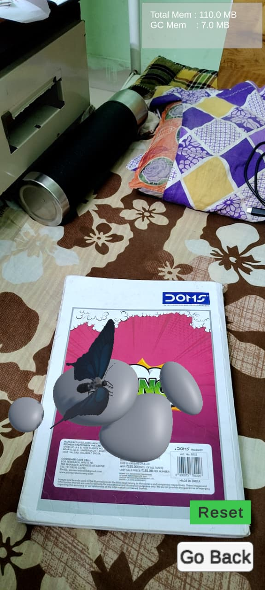
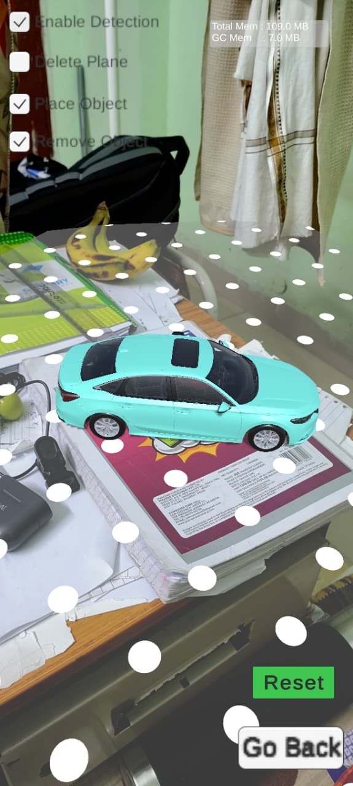
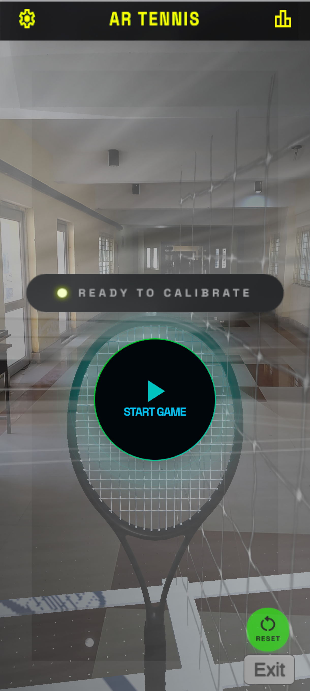
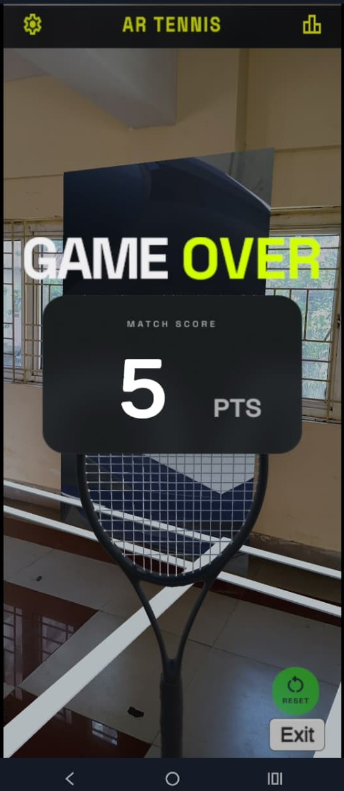
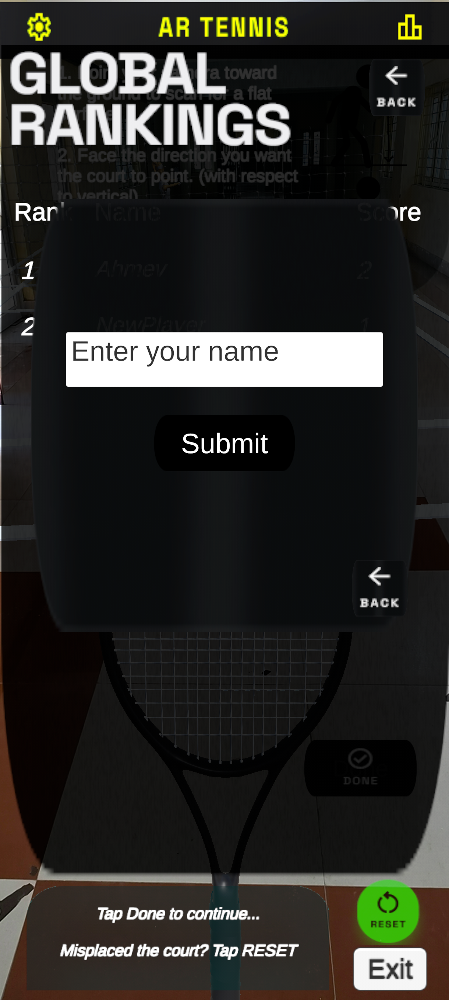
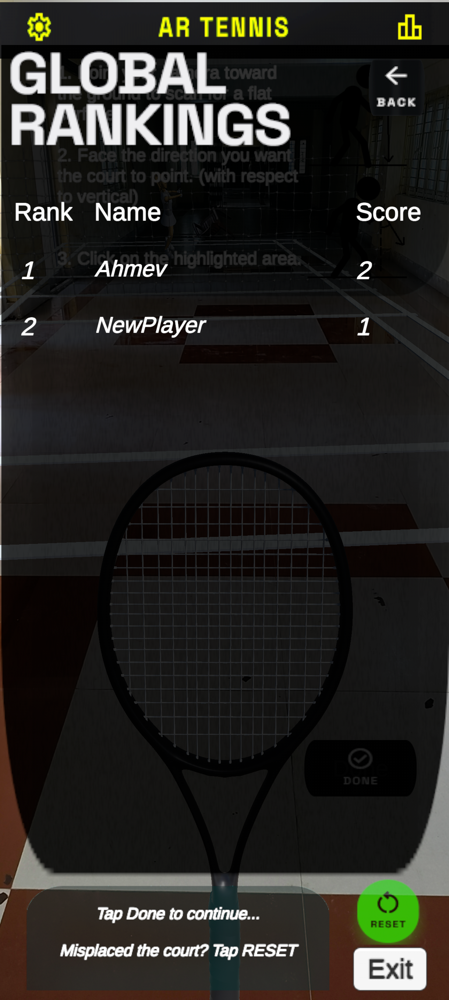

# AR Tennis Mobile (Unity AR foundation : ARCore)

## 🎾 Main Highlight: AR Tennis (Ball Shooting Game)
The centerpiece of this repository is **BallShootingGameScene** (and its extended version `BallShootingGameSceneExtension`). 

This is a fully playable **AR Tennis** mini-game where:
- A tennis court anchors to the detected ground plane.
- An automated ball launcher shoots physics-based balls at the player.
- The player uses their phone as a racket (camera-tracked) to hit balls back.
- **Features:**
  - **Live Scoreboard:** Animated in-game scoreboard (Diegetic UI) that tracks hits, misses, and high score.
  - **PlayFab Integration:** Cloud-backed leaderboards, player authentication, and remote config.
  - **Video Playback:** Remote video loading for billboards/ads within the AR scene.
  - **Tutorial Mode:** A guided introduction for new players to learn the game mechanics.
  - **Customization:** Player can input a **Display Name** for the global leaderboard.
  - **UI Overhaul:** Polished UI elements imported using Google Stitch for a cohesive look.

It demonstrates advanced AR interaction, physics, camera tracking, and game logic integration to build a complete AR mini-game. The game leverages PlayFab for cloud-based improvements.

## 🏆 PlayFab Integration
This project integrates **PlayFab** for backend services, primarily to manage player statistics and leaderboards.
- **Scripts:** located in `Assets/ScriptsPlayFab`
  - `PlayFabLogin.cs`: Handles anonymous login using device ID and manages display name updates.
  - `LeaderboardManager.cs`: Submits scores to the PlayFab leaderboard and retrieves top player rankings.
- **Usage:**
  - The `BallShootingGameSceneExtension` Scene updates the high score to the PlayFab backend upon game over.
  - Players are automatically logged in on start.
  - **Display Name Input:** Players can entering a custom name to appear on the leaderboard.
  - **Leaderboard Display:** The top scores are fetched and displayed in-game on Android devices.
  - **Remote Video:** The billboard in the scene plays video content from a remote URL (administered via PlayFab TitleData).

## 📂 Also See: Core AR Demos
Beyond the game, this project safeguards a suite of focused demos for learning specific AR Foundation features:

- **ScenePrime** – The core playground for **Plane Detection**. Includes multi-mode placement (Tap to Place, Drag to Move/Rotate) and debug visualizations.
- **ImageTrackingScene** – Demonstrates **Image Tracking**. Uses a reference library to detect physical images and spawn matching prefabs.
- **PointCloudScene** – Shows how to use **Point Clouds** (Feature Points) for placement when planar surfaces aren't available.
- **carScene** & **Scene_Dragon** – Examples of anchoring specific objects (Car, Dragon) to detected planes using specialized placement scripts.
- **6daysScene** – A high-fidelity showcase for placing a detailed car model (Lamborghini) on planes.

---

Repo URL : [AR-Tennis-Mobile](https://github.com/Ahmev-Ayush/AR-Tennis-Mobile.git)

An AR Foundation sample focused on reliable plane detection, responsive placement controls, and lightweight diagnostics. The project targets Unity **6000.2.6f2** (Unity 6) and ships with XR Interaction Toolkit, ARCore XR Plug-in, and AR Foundation 6.2, making it a solid starting point for Android AR prototypes.

## Demo Visuals
- **ImageTrackingScene** – configured with a reference image library to test `ImageTrackingManager` and prefab spawning.

 

🎬 [Watch video 1 →](./Demo_Videos_and_Images/imageTracking_video1.mp4) | [Watch video 2 →](./Demo_Videos_and_Images/imageTracking_video2.mp4)

- **PointCloudScene** – use to place a flying saucer prefab to interact with point cloud feature points.

 

🎬 [Watch video →](./Demo_Videos_and_Images/PointCloudScene_video.mp4)

- **carScene** & **Scene_Dragon** – uses the car and dragon placement scripts to anchor a vehicle and dragon prefab on detected planes.

 


- **6daysScene** – A dedicated scene for placing a high-fidelity car model (Lamborghini) on detected planes, showcasing refined placement logic.

🎬 [Watch video →](./Demo_Videos_and_Images/lamboVideoWithAudio_video.mp4)

- **BallShootingGameScene** ⭐ — **Best scene in the repo.** A fully playable AR tennis mini-game: the court anchors to a real-world plane, balls fire automatically, and you hit them with a racket that follows your camera.
  - **Features:** Live scoreboard, high-score persistence, reset functionality.
  - **Integrated with PlayFab** for online leaderboard and player statistics.
  - **Recent Updates:** Integrated video playback on court screens (via URL), improved court orientation logic, and experimental standing/sitting posture adjustments.

 
 

🎬 [Watch video →](./Demo_Videos_and_Images/BallShooting_video1.mp4)
🎬 [Watch video →](./Demo_Videos_and_Images/BallShooting_video2.mp4)


## Note: View demo videos: [Demo_Videos_and_Images](./Demo_Videos_and_Images)

## 🧠 Technical Learnings & Challenges
This project served as a deep dive into advanced AR development. Key takeaways include:

1. **Backend Integration (PlayFab):**
   - Learned to implement **Cloud Scripting** concepts using PlayFab for leaderboards and player authentication.
   - Handled asynchronous data fetching to display global high scores in real-time on Android devices.

2. **AR Physics & Mathematics:**
   - Implemented complex **projectile motion algorithms** to calculate ball trajectories that align with real-world physics and camera depth.
   - Solved challenges with **coordinate space mapping** between the AR Session space and game world objects.

3. **Optimization Techniques:**
   - Reduced APK size significantly by switching from local video assets to **remote URL streaming** for in-game billboards/ads.
   - Managed **AR Plane visibility** toggling to improve immersion (hiding planes after game start).

4. **UI/UX in AR:**
   - Moved from standard screen-overlay UI to **Diegetic UI** (in-world scoreboards) to maintain player immersion.
   - Integrated polished UI assets using **Google Stitch** (Figma to Unity workflow) to create a professional look and feel.

## Project Structure
```text
📦 YourProject/
├── 📂 Assets/
│   ├── 📂 Butterfly (Animated)/
│   ├── 📂 MobileARTemplateAssets/
│   │   ├── 📂 Materials/
│   │   ├── 📂 Prefabs/
│   │   └──  📂 Scripts/     ← All scripts used in the project are here
│   │       ├──📂 6daysSceneScripts/
│   │       ├──📂 ball_shooting/
│   │   ├── 📂 Shaders/
│   │   ├── 📂 Tutorial/
│   │   └── 📂 UI/
│   ├── 📂 Prefabs/         ← All prefabs are here that are used in the project
│   ├── 📂 Resources/
│   │   ├── 📂 Images/      
│   │   └── 📂 Materials/   ← All Materials are here that are used in the project
│   ├── 📂 Samples/
│   ├── 📂 Settings/
│   ├── 📂 Scenes/
│   ├── 📂 TextMesh Pro/
│   ├── 📂 XR/
│   ├── 📂 PlayFabEditorExtensions/
│   ├── 📂 ScriptsPlayFab/
│   └── 📂 models/
├── 📂 Packages/
├── 📂 ProjectSettings/
├── 📂 Demo_Videos_and_Images/                  ← demos videos and screenshots
│   ├── 📂 /
│   ├── 📂 /
├── 📄 .gitignore
├── 📄 README.md
├── 📄 project-structure.txt   
└── 📄 DEVLOG.md               
```

## Requirements
- Unity Hub with **Unity 6000.2.6f2** plus Android  Build Support, OpenJDK, and SDK/NDK tools.
- ARCore-compatible device running **Android 11 (API level 30)** or higher.
- USB debugging enabled (Android).
- Optional: TextMeshPro Essentials imported (already configured in this project) for the diagnostics overlay.

## Quick Start
1. Clone the repository (`git clone https://github.com/Ahmev-Ayush/AR-Tennis-Mobile.git`) or download the ZIP into a local folder.
2. Open Unity Hub → **Open** → select `Plane Detection/Plane Detection.sln` or the folder root.
3. When prompted, install Unity 6000.2.6f2; allow the Editor to update the project.
4. In **Build Settings**, switch the platform to **Android**  and click **Apply**.
5. Open `Assets/Scenes/ScenePrime.unity` to explore the standard plane-detection flow. Use Play Mode with a webcam/AR simulation or deploy to device for accurate tracking.
6. Connect a device, press **Build & Run**, and test the placement modes, menu toggles, and debug overlays directly on hardware.

## Building for Device
- **Android**: 
	- Enable **ARM64** architecture with IL2CPP and strip unused managed code for smaller builds.
	- Under **Project Settings → XR Plug-in Management**, enable **ARCore** for Android and ensure required permissions (camera) are checked.
	- If you use feature-point placement, keep depth and point-cloud subsystems enabled in **XR Origin**:

## Ball Shooting Mini-Game Flow
- Launch flow: `StartUIInBallShootingScene` gates the welcome and adjust overlays before play begins.
- Court setup: `prefabScalerForBallShooting` sizes the court/racket/ball prefabs and positions the court in front of the camera.
- Racket tracking: `racketFollow` parents the racket offset to the AR camera and adjusts distance as the scale changes.
- Firing loop: `BallLauncher` spawns physics balls on an interval; `tennisBall` tracks player hits for scoring or effects.
- Video Playback: `VideoPlayerController` streams video content on court screens via URL to keep the build size low.
- Scene entry: Use the buttons wired to `changeScene` to jump into `BallShootingGameScene` from the main menu.

## Performance Overlay
1. Drop the **PerformanceMonitor** prefab (or add the script to an empty GameObject) inside your scene Canvas.
2. Assign a TextMeshProUGUI element to `statsText`.
3. Press Play or deploy; memory usage (MB) and GPU frame time (ms) will stream in real time.
4. Uncomment the draw-call line inside `Update()` if you want render-thread statistics too.

## Troubleshooting
- **No planes appear in Play Mode** – Verify your XR Origin includes an `ARPlaneManager` with the plane prefab assigned and that plane detection is toggled on in `ARModeController`.
- **Layer-based deletion fails** – Confirm you created `ARPlanes` and `PlacedObjects` layers and assigned them to plane prefabs and spawned objects respectively.
- **Image targets never track** – Check that the active XR Reference Image Library is linked to `ARTrackedImageManager` and that the physical print size matches the library metadata.
- **Build errors about missing TMP assets** – Reimport TextMeshPro Essentials via `Window → TextMeshPro → Import TMP Essential Resources`.

## What I Learned

| Area | Key Takeaways |
|---|---|
| **AR Foundation** | How `ARPlaneManager`, `ARRaycastManager`, and `ARTrackedImageManager` work together to provide stable world anchors |
| **Plane Detection** | Tuning plane mesh faders, handling plane life-cycle events, and merging overlapping planes cleanly |
| **Image Tracking** | Setting up reference image libraries, handling `trackingStateChanged` events, and spawning/despawning prefabs reliably |
| **Point Cloud** | Using feature points as alternative placement targets when flat planes aren't available |
| **Physics in AR** | Attaching Rigidbodies and colliders to AR-anchored objects; tuning bounciness (0.8) for realistic but playable ball bounce |
| **Prefab Scaling** | Dynamically scaling anchored prefabs to match real-world size using `prefabScalerForBallShooting` |
| **Camera-Follow UI** | Offsetting world-space objects from the AR camera transform for a reliable racket-tracking feel |
| **Scriptable Objects** | Using `BallShootingScriptableObjectScript.cs` (ScriptableObject) to centralise game values and avoid magic numbers |
| **New Input System** | Migrating from the legacy Input system to Unity's New Input System (`PlaceDragInScene_NewInputSystem.cs`) |
| **Performance Monitoring** | Building a live FPS/memory overlay (`PerformanceMonitor.cs`) with TextMeshPro for on-device diagnostics |
| **Scene Management** | Wiring multi-scene navigation with `changeScene.cs` and `GoalManager.cs` |
| **Video Playback** | Integrating `VideoPlayer` to stream video textures on 3D objects via URL (`VideoPlayerController.cs`) |
| **Spatial UI** | Implementing world-space UI (e.g., the scoreboard in `BallShootingGameSceneExtension`) that exists physically in the AR environment instead of a screen overlay |
| **Backend (PlayFab)** | Implementing **Cloud Scripting** and async data fetching for global leaderboards and player auth (Logins). |
| **UI/UX & Workflow** | Transitioning to **Diegetic UI** (world-space) and using **Google Stitch** (Figma to Unity) for polished asset integration. |
| **Optimization** | Reducing APK size by streaming video textures via **Remote URLs**; managing plane visibility for immersion. |


## License
Distributed under the [MIT License](LICENSE). Review the license text before shipping commercial builds or redistributing modified assets.
